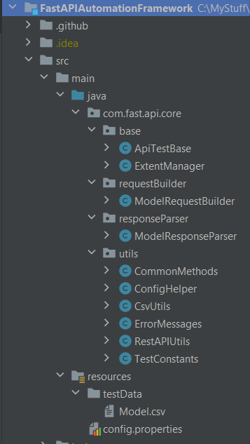
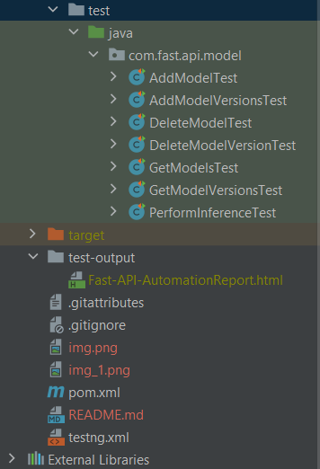
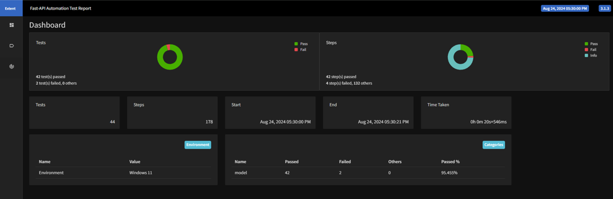
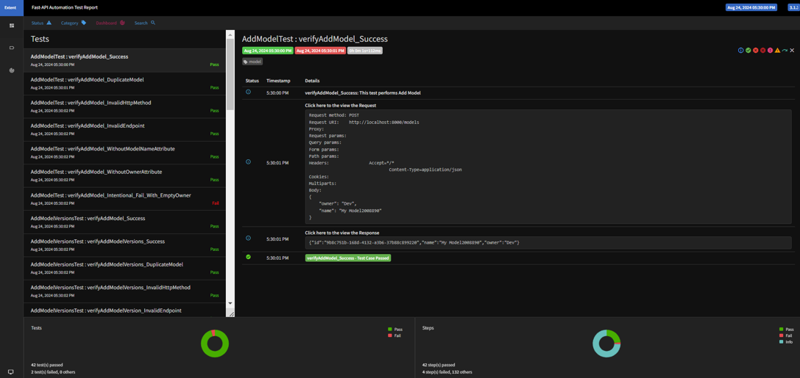
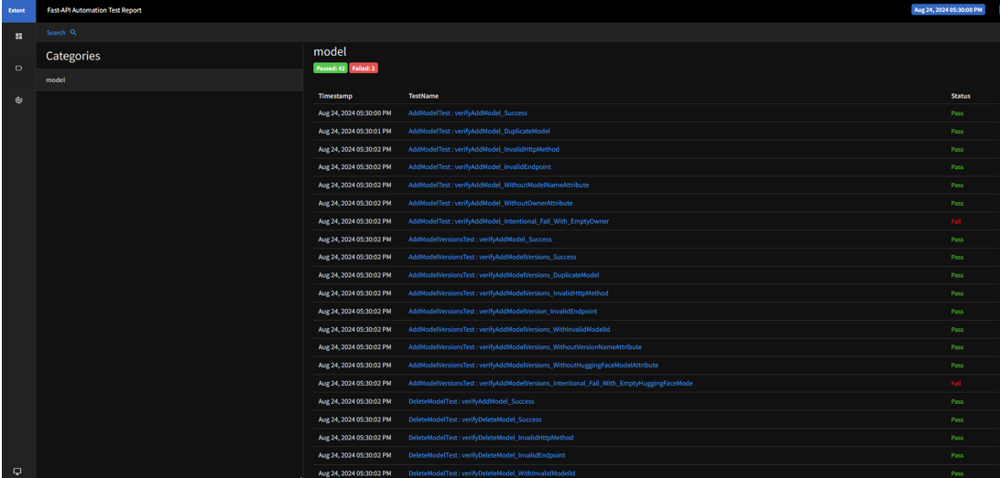
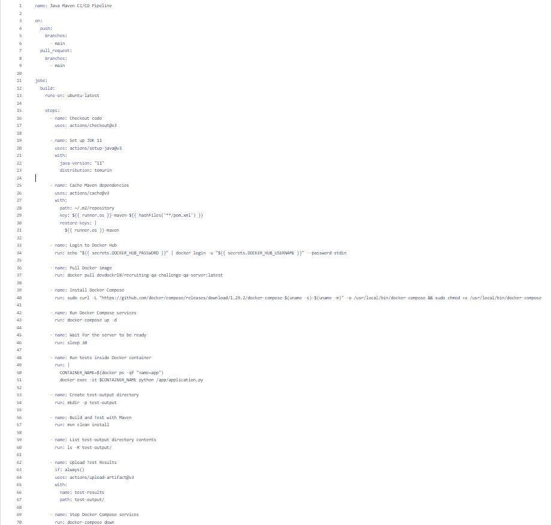
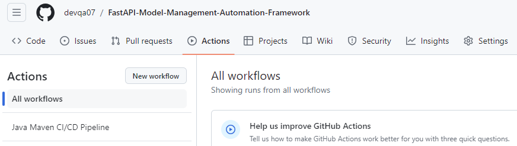
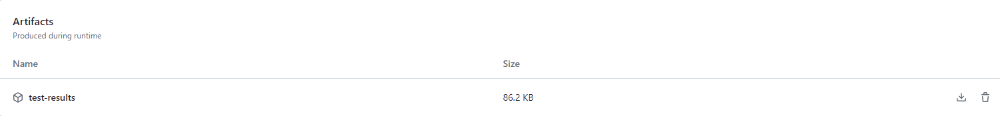

**<h2>FastAPI Model Management Automation Framework:**</h2>

This is a comprehensive API automation framework designed to manage Model and Model Version entities 
within a FastAPI-based application. It provides extensive scripting capabilities for creating, updating, and deleting models and their versions. 
Additionally, the framework includes a powerful inference endpoint to facilitate automated testing of model predictions.

The framework leverages Java with the Rest Assured library for API automation, TestNG for test orchestration, Maven for build automation, opencsv for test data management 
and Extent Reports for generating detailed and visually engaging test reports. It is seamlessly integrated with GitHub Actions, ensuring automated testing with every code commit and pull request, supporting efficient CI/CD operations. 

****Prerequisites: **** 

Before getting started, make sure you have the following installed
* Java Development Kit (JDK) 11 or higher 
* Rest-assured version 5 or higher 
* Apache Maven 3.3 or higher 
* TestNG 3.7 or higher
* Extent reports 3.1.3 or higher 
* An IDE like IntelliJ IDEA or Eclipse 
* Git for version control and managing the repository
* Docker Desktop app and respective libraries for windows or Mac OS
 

****Features: ****

* Model Management: Automate CRUD (Create, Read, Update, Delete) operations for Model entities.
* Model Versioning: Manage different versions of models with full lifecycle support.
* Inference Endpoint: Automate testing of the model inference endpoint to ensure accurate predictions.
* Comprehensive Testing: Leverage Java and Rest Assured for API automation with TestNG for test management.
* Detailed Reporting: Generate detailed and visually appealing test reports using Extent Reports.
* CI/CD Integration: Seamless integration with GitHub Actions for continuous integration and deployment.
 

****Framework Structure:****

* **base**:This package consists of all the reusable methods which are common and reusable throughout the framework

* **requestBuilder**:This package consists of the requestBuilder(RequestBody) methods for different API requests

* **responseParser**:This package consists of the response validation methods for the different APIs.

* **utils**: This package consists of all the utilities which are common and reusable throughout the framework

* ****resources:****

    * **config.properties** It contains the base urls, different environments and different APIs endpoints.

  * **testData**:It contains the input test Data(.csv) files

* **test**: It contains all the Success and Error test case scenarios.

* **pom.xml**: It contains all the required dependencies and libraries to run the project.

* **testng.xml**: It contains all the tests/packages to be run in the test suite.

 

 

****How to run the tests:****

1. Clone the recruiting-qa-challenge github repository in the local machine as it contains server to run the application
2. Start the Docker desktop app
3. Open CMD/terminal and go to recruiting-qa-challenge python application directory(cd recruiting-qa-challenge)
4. Run the commands as **docker compose up** for starting the server and **docker compose down** stopping the server respectively
5. Clone the framework repository(https://github.com/devqa07/FastAPI-Model-Management-Automation-Framework.git) from GitHub
6. Open the IDE(IntelliJ or Eclipse) and open/import the project
7. Got to terminal/CMD and run the command **mvn clean install** or we can also run the complete test suite from testng.xml 
8. Wait for the test execution completion and then navigate to test-output folder and open the Fast-API-AutomationReport.html in any browser for detailed test report dashboard
 

****test-output:****

Test Execution Reports(open Fast-API-AutomationReport.html in a browser to see the detailed report), the report looks as follows: 

  
  
  

******CI/CD Pipeline Structure and Details:******  

This project uses GitHub Actions and Docker container to automate the Continuous Integration/Continuous Deployment (CI/CD) pipeline.
Below is an overview of the pipeline structure and the steps involved. Job is configured in **.github/workflows/ci-cd.yml** as follows:

  

****Pipeline Trigger Conditions:****  

The pipeline is triggered under the following conditions:
* Push Events-The pipeline runs whenever there is a push to the main branch.
* Pull Requests-The pipeline also runs for any pull requests targeting the main branch.
 

**Jobs and Steps Details**

The pipeline is defined under the jobs section, where we specify the build job that runs on the ubuntu-latest virtual environment provided by GitHub 
and tests will run under Docker container 

**1.** **Checkout Code**

    name: Checkout code
    uses: actions/checkout@v3
    - Purpose: This step checks out the code from the repository so that the subsequent steps have access to the latest codebase.
    - Action: It uses the actions/checkout@v3 action to pull the source code onto the runner.  

    
**2.** **Set up JDK 11**

      name: Set up JDK 11
      uses: actions/setup-java@v3
      with: 
      java-version: '11'
     distribution: temurin
     - Purpose: Configures the Java Development Kit (JDK) environment to ensure the code is compiled and executed using JDK 11.
     - Action: The actions/setup-java@v3 action is used to set up the Java environment with the temurin distribution.  
     

**3.** **Cache Maven Dependencies**  

      name: Cache Maven dependencies
      uses: actions/cache@v3
      with:
      path: ~/.m2/repository
      key: '${{ runner.os }}-maven-${{ hashFiles(''**/pom.xml'') }}'
   
      restore-keys: '${{ runner.os }}-maven'
      Purpose: Caching Maven dependencies speeds up the build process by reusing dependencies from previous builds.
      Action: The actions/cache@v3 action is used to cache the .m2 directory, where Maven stores downloaded dependencies. 
     

**4. Create test-output Directory**

    name: Create test-output directory
    run: mkdir -p test-output
     Purpose: This step creates a directory named test-output where test results will be stored.
     Action: The mkdir -p test-output command ensures that the directory is created before the tests run.
     
**5. Build and Test with Maven**

    name: Build and Test with Maven
    run: mvn clean install
    Purpose: Compiles the code, runs the tests, and packages the application.
    Action: The mvn clean install command cleans the target directory, compiles the code, runs all tests, and packages the project as defined in the pom.xml file.  

**6. List test-output Directory Contents**

        name: List test-output directory contents
        run: ls -R test-output/
        Purpose: This optional step lists the contents of the test-output directory to verify that the test results have been generated correctly.
        ction: The ls -R test-output/ command recursively lists the contents of the test-output directory. 

**7. Upload Test Results**
   
          name: Upload Test Results
           if: always()
           uses: actions/upload-artifact@v3
           with:
           name: test-results
           path: test-output/
           Purpose: Uploads the test results as an artifact that can be reviewed later.
           Action: The actions/upload-artifact@v3 action uploads the contents of the test-output/ directory as a named artifact (test-results). The if: always() condition ensures this step runs even if previous steps fail, providing access to test results for debugging purposes. 

**8. Login to Docker Hub**

        name: Login to Docker Hub
        run: echo "${{ secrets.DOCKER_HUB_PASSWORD }}" | docker login -u "${{ secrets.DOCKER_HUB_USERNAME }}" --password-stdin
        Purpose: Authenticates with Docker Hub to pull Docker images.
        Action: Uses Docker login credentials stored in GitHub secrets to log in to Docker Hub.

**9. Pull Docker Image**

    name: Pull Docker image
    run: docker pull devdockr18/recruiting-qa-challenge-qa-server:latest
    Purpose: Retrieves the latest version of the Docker image required for the pipeline.
    Action: Pulls the Docker image devdockr18/recruiting-qa-challenge-qa-server:latest from Docker Hub.

**10. Install Docker Compose**

    name: Install Docker Compose
    run: sudo curl -L "https://github.com/docker/compose/releases/download/1.29.2/docker-compose-$(uname -s)-$(uname -m)" -o /usr/local/bin/docker-compose && sudo chmod +x /usr/local/bin/docker-compose
    Purpose: Installs Docker Compose to manage multi-container Docker applications.
    Action: Downloads and installs Docker Compose from the official GitHub repository.

**11. Run Docker Compose Services**

    name: Run Docker Compose services
    run: docker-compose up -d
    Purpose: Starts the Docker Compose services in detached mode.
    Action: Runs docker-compose up -d to start all services defined in the docker-compose.yml file.

**12. Wait for the Server to Be Ready**

    name: Wait for the server to be ready
    run: sleep 30
    Purpose: Ensures that the server is fully initialized and ready to handle requests before running tests.
    Action: Introduces a delay of 30 seconds.

**13. Run Tests Inside Docker Container**

    name: Run tests inside Docker container
    run: |
    CONTAINER_NAME=$(docker ps -qf "name=app")
    docker exec -it $CONTAINER_NAME python /app/application.py
    Purpose: Executes the tests within the Docker container to ensure the application works as expected.
    Action: Identifies the running container and executes the test script application.py

**14. Stop Docker Compose Services**

    name: Stop Docker Compose services
    run: docker-compose down
    Purpose: Stops and removes Docker Compose services.
    Action: Runs docker-compose down to clean up the environment after the tests are complete.

**15. Viewing GitHub action activity** 

Once the GitHub actions are configured and start running, we can view each step’s activity on GitHub.

Go to the FastAPI-Model-Management-Automation-Framework repository and under the repository name, click on the Actions tab and select the Java Maven CI/CD Pipeline workflow to see the status and details

  

**HTML Report**

Test Report/execution html report for a specific run can be downloaded from the **Artifacts** section as follows:

  
  
 

**Advantages and Drawbacks of the above approach:**  

**Advantages:**

1. **Consistency & Reliability:** Ensures tests are run in a controlled environment, providing consistent and reliable feedback on API health.
2. **CI/CD Integration:** Enables automatic testing and deployment on every code push or pull request, accelerating the development process.
3. **Comprehensive Test Coverage:** Supports various test types (integration and regression testing) to minimize bugs and regressions.
4. **Scalability:** Easily extendable with new test cases and integration with additional tools as the project grows.
5. **Version Control:** Tracks changes in both the automation framework and GitHub Actions workflows, ensuring stability and traceability.
6. **Cost-Efficiency:** Utilizes GitHub Actions' managed environment, reducing the need for separate CI/CD infrastructure and lowering operational costs.
7. **Isolated Testing Environment:** Docker provides a consistent and isolated environment for testing, improving reliability and accuracy.

**Drawbacks:**  

1. **Learning Curve:** It requires familiarity with GitHub Actions, Docker, and CI/CD practices, which may be challenging for team members new to these tools.
2. **Increased Complexity:** It adds layers of complexity in managing the framework, Docker containers, and CI/CD pipelines, which may require more maintenance.
3. **Debugging Challenges:** Debugging issues within the CI/CD pipeline or Docker containers can be more difficult compared to running tests directly on a local machine.
4. **Resource Consumption:** Running extensive tests in parallel or within Docker containers can be resource-intensive, potentially impacting performance, especially on limited hardware.

